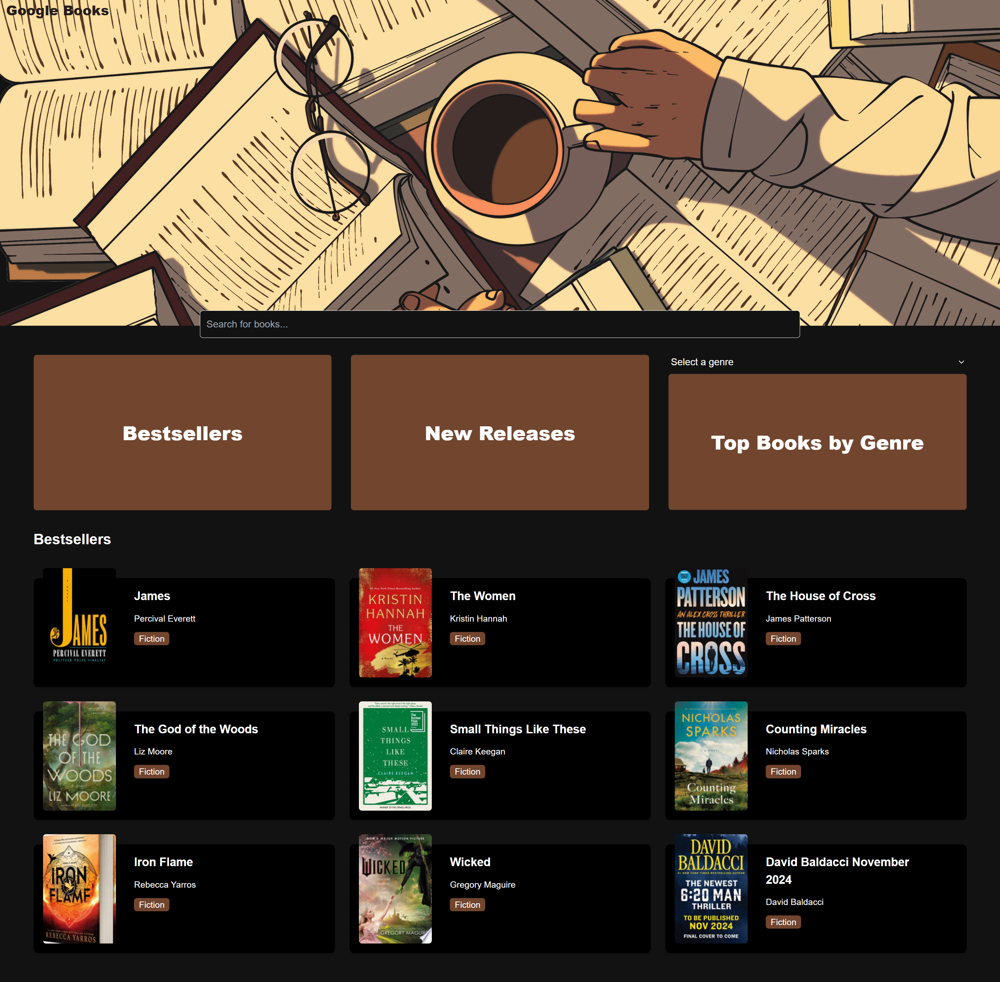

# Google Books Browser
The Google Books Browser is a web-based platform designed to create a user-friendly interface for searching a vast library of books, making use of the external APIs from Google Books API and the New York Times Best Sellers API. 
This full-stack client-server application allows users to search for books and receive real-time updates on new releases, gaining access to useful details on the books of interest, bestsellers, and categorized recommendations.

## Available documentation

- [User Guide](assets/Google%20Books%20Browser%20User%20Guide.pdf)
